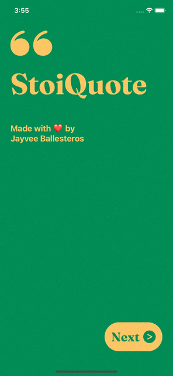

### Hi there 

<a href="https://twitter.com/xcoding_jb"  target="_blank" >
  
</a>
<a href="https://www.linkedin.com/in/jayveeballesteros/" target="_blank" >
  
</a>
<a href="https://jvbllstrs.me/playlist" target="_blank" >
  
</a>
<a href="https://github.com/jayveeballesteros" target="_blank" >
  
</a>

<br>
<br>

```swift

import Foundation

struct Profile: CustomStringConvertible {

    let name = "Jayvee Ballesteros"
  
    var description: String {
        """
        \(name)\n
        BS Information Technology graduate with passion for iOS development and design. 
        Majority of the time I practice with native iOS applications using Swift, UIKit,
        and trying to explore future possibilities for SwiftUI, always open to learning 
        new technologies and frameworks.\n

        """
    }
  
    enum Skill: String, CaseIterable {
    case swift, uIKit, swiftUI
    case sketch, blender, finalCut
    }
 
    func proficient(in skills: [Skill] = .allCases) -> String {
        skills
            .lazy
            .map(\.rawValue)
            .map(\.capitalized)
            .map { "- " + $0 + "\n" }
            .reduce("Skills: \n", +)
    }
}

// Paste into a playground!
let profile = Profile()
print(profile.description)
print(profile.proficient())

```
#  StoiQuote

StoiQuote is a simple app that displays random quotes about Stoicism.

> SwiftUI, API Request



<a href="https://github.com/jayveeballesteros/StoiQuote"></a>

<br>
